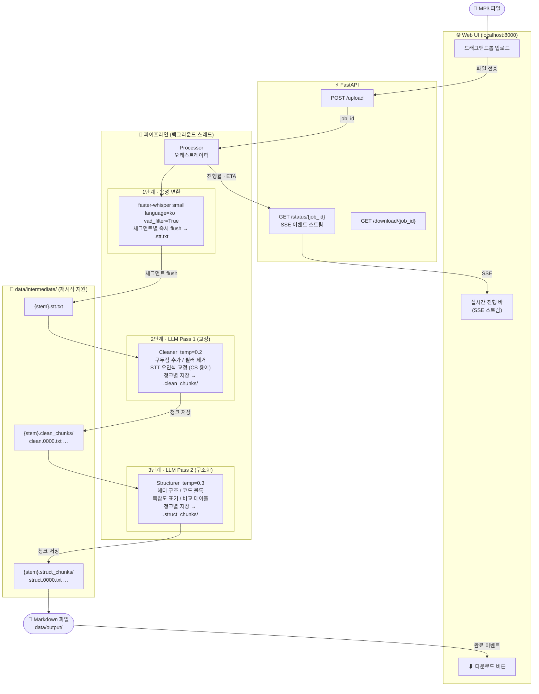

# KNOU 강의 MP3 → Markdown 자동 변환 파이프라인

방송통신대학교(KNOU) 강의 MP3 파일을 **읽을 수 있는 마크다운 문서**로 자동 변환하는 파이프라인입니다.
로컬 Whisper로 음성을 전사하고, LLM 2단계 처리로 내용을 정제·구조화합니다.

---

## 데이터 흐름



### 재시작 내성

`docker compose down` 으로 어느 시점에 중단해도 **다음 실행에서 완료된 지점부터 재개**합니다.

| 중단 시점 | 저장 단위 | 재시작 후 동작 |
|-----------|-----------|---------------|
| 전사 중 | 세그먼트마다 flush | 저장된 `.stt.txt` 재사용, 전사 건너뜀 |
| LLM Pass 1 중 | 청크 완료마다 저장 | 완료된 청크 재사용, 미완료 청크부터 재개 |
| LLM Pass 2 중 | 청크 완료마다 저장 | 완료된 청크 재사용, 미완료 청크부터 재개 |

---

## 주요 기능

- **로컬 STT** — `faster-whisper` 로 오프라인 전사 (API 비용 없음)
- **실시간 진행률** — 세그먼트 타임스탬프 기반 진행률 + 남은 시간 ETA
- **LLM 벤더 추상화** — OpenAI ↔ Anthropic을 `.env` 한 줄로 전환
- **CS 특화 프롬프트** — 자료구조·알고리즘·운영체제·DB·네트워크 용어 교정
- **Web UI** — 드래그앤드롭 업로드, 카드별 진행 바, 완료 즉시 다운로드
- **Docker 단일 명령** — `docker compose up` 으로 즉시 실행

---

## 기술 스택

| 역할 | 라이브러리 |
|------|-----------|
| STT | `faster-whisper` |
| LLM | `anthropic` / `openai` (교체 가능) |
| Web 서버 | `FastAPI` + `uvicorn` |
| 실시간 알림 | SSE (Server-Sent Events) |
| 설정 관리 | `pydantic-settings` |
| API 재시도 | `tenacity` (지수 백오프) |
| 폴더 감시 | `watchfiles` |
| CLI | `click` |

---

## 시작하기

### 사전 요구사항

- Docker Desktop
- OpenAI 또는 Anthropic API 키

### 설치 및 실행

```bash
git clone https://github.com/gukin-han/knou-lecture-pipeline.git
cd knou-lecture-pipeline

# 환경 변수 설정
cp .env.example .env
# .env 파일에서 OPENAI_API_KEY (또는 ANTHROPIC_API_KEY) 입력

# 실행
docker compose up --build
```

브라우저에서 **http://localhost:8000** 접속 후 MP3 파일을 드래그앤드롭합니다.

---

## 사용법

### Web UI (권장)

1. `docker compose up` 실행
2. http://localhost:8000 접속
3. MP3 파일 드래그앤드롭
4. 진행 바에서 단계별 진행률 확인
5. 완료 후 **⬇ 다운로드** 클릭

### CLI

```bash
# 단일 파일 처리
docker compose run --rm pipeline knou-pipeline process lecture_01.mp3

# 폴더 감시 모드 (data/input/ 에 파일을 넣으면 자동 처리)
docker compose run --rm pipeline knou-pipeline watch

# 중단된 파일 재처리
docker compose run --rm pipeline knou-pipeline resume lecture_01.mp3
```

---

## 설정

`.env` 파일에서 모든 설정을 변경할 수 있습니다.

| 변수 | 기본값 | 설명 |
|------|--------|------|
| `LLM_PROVIDER` | `openai` | `openai` 또는 `anthropic` |
| `OPENAI_API_KEY` | — | OpenAI API 키 |
| `OPENAI_MODEL` | `gpt-4o` | 사용할 모델 |
| `ANTHROPIC_API_KEY` | — | Anthropic API 키 |
| `ANTHROPIC_MODEL` | `claude-sonnet-4-6` | 사용할 모델 |
| `WHISPER_MODEL_SIZE` | `small` | `tiny` · `base` · `small` · `medium` · `large-v3` |
| `WHISPER_DEVICE` | `auto` | `auto` · `cpu` · `cuda` |
| `CHUNK_SIZE` | `6000` | LLM에 보내는 청크 크기 (문자 수) |

### Whisper 모델 크기별 속도 비교 (CPU 기준, 1시간 강의)

| 모델 | 처리 시간 | 한국어 정확도 |
|------|----------|-------------|
| `small` | ~10분 | 보통 (LLM 교정으로 보완) |
| `medium` | ~60분 | 좋음 |
| `large-v3` | ~4-8시간 | 최고 |

---

## 프로젝트 구조

```
knou-lecture-pipeline/
├── config/
│   └── settings.py          # Pydantic BaseSettings (.env 자동 로드)
├── pipeline/
│   ├── llm_client.py        # LLM 벤더 추상화 (Anthropic / OpenAI)
│   ├── transcriber.py       # faster-whisper STT (세그먼트별 flush)
│   ├── cleaner.py           # LLM Pass 1: 텍스트 교정
│   ├── structurer.py        # LLM Pass 2: 마크다운 구조화
│   └── processor.py         # 파이프라인 오케스트레이터
├── web/
│   ├── app.py               # FastAPI 엔드포인트
│   ├── job_manager.py       # 작업 큐 + SSE 이벤트 배포
│   └── static/              # HTML / CSS / JS
├── watcher/
│   ├── cli.py               # Click CLI (watch / process / resume)
│   └── folder_watcher.py    # watchfiles 기반 폴더 감시
├── prompts/
│   ├── pass1_cleanup.txt    # CS 특화 교정 프롬프트
│   └── pass2_structure.txt  # CS 특화 구조화 프롬프트
├── utils/
│   ├── file_utils.py        # 문장 경계 기반 청크 분할
│   ├── logger.py            # 로거 설정
│   └── retry.py             # tenacity 재시도 데코레이터
├── data/
│   ├── input/               # MP3 입력 위치
│   ├── output/              # 최종 .md 출력
│   ├── intermediate/        # 중간 파일 (재시작 지원)
│   ├── processed/           # 완료된 MP3 보관
│   └── failed/              # 실패한 파일 격리
├── Dockerfile
├── docker-compose.yml
└── .env.example
```
