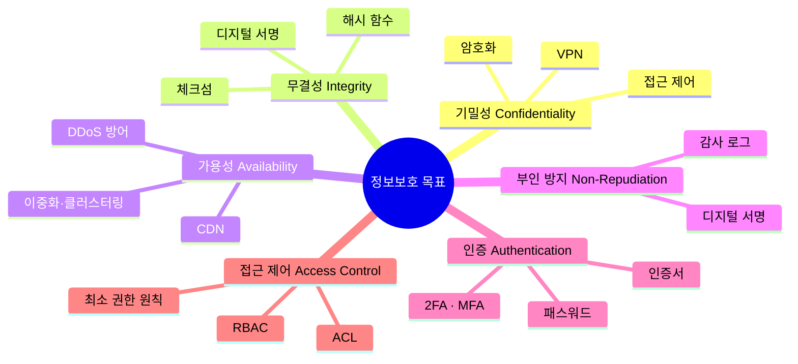
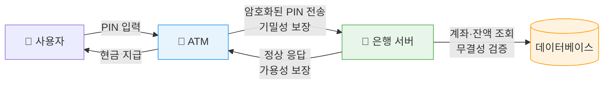
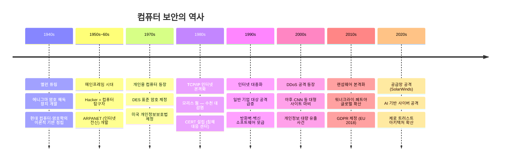
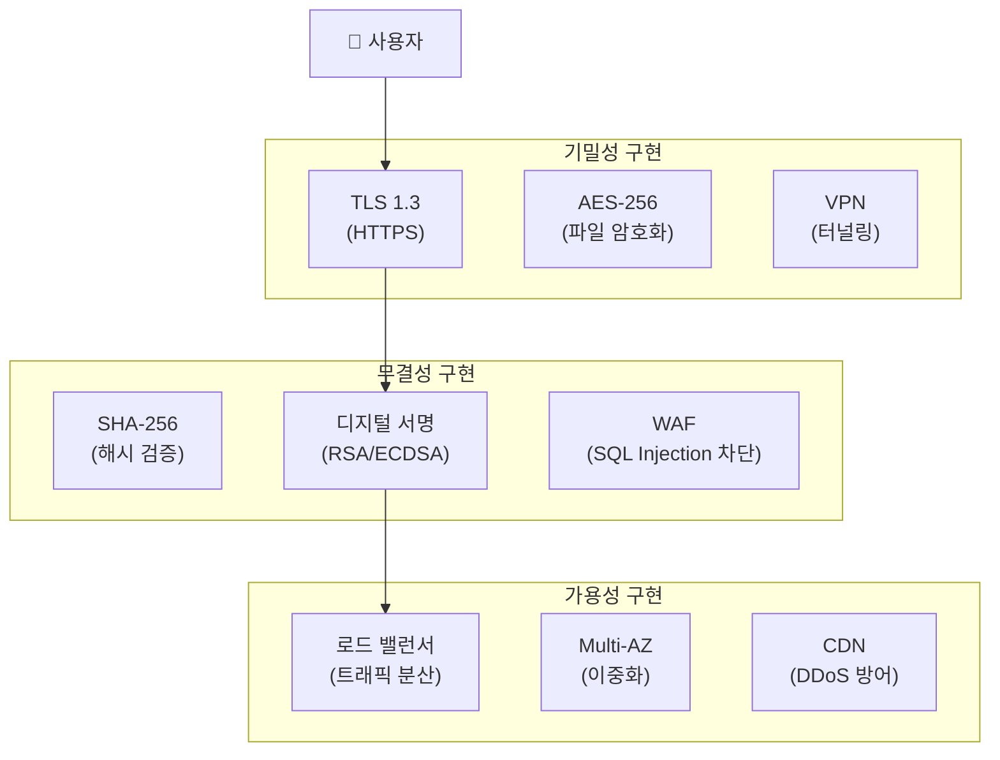
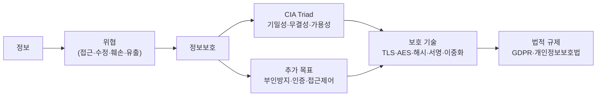

# 1강 · 컴퓨터 보안 개요

## 목차

- [정보보호의 개념](#정보보호의-개념)
- [정보보호의 핵심 목표 — CIA Triad](#정보보호의-핵심-목표--cia-triad)
  - [세 가지 핵심 목표 비교](#세-가지-핵심-목표-비교)
  - [기밀성](#기밀성)
  - [무결성](#무결성)
  - [가용성](#가용성)
- [ATM 기기로 보는 CIA](#atm-기기로-보는-cia)
- [추가 정보보호 목표](#추가-정보보호-목표)
- [공격 유형과 CIA 위반 분류](#공격-유형과-cia-위반-분류)
- [컴퓨터 보안의 역사](#컴퓨터-보안의-역사)
- [국가별 정보보호 법률 비교](#국가별-정보보호-법률-비교)
- [실무 적용 — CIA를 구현하는 기술](#실무-적용--cia를-구현하는-기술)
- [정보화 사회의 역기능](#정보화-사회의-역기능)
- [요약](#요약)

---

## 정보보호의 개념

> **정보보호**: 정보를 여러 가지 위협으로부터 보호하기 위한 정책이나 기법

정보는 두 가지 상태로 존재한다.

- **저장 상태** — 데이터베이스, 파일 시스템, 클라우드 스토리지
- **전송 상태** — 네트워크를 통해 이동 중인 데이터

위협의 종류: 허락되지 않은 접근 · 수정 · 훼손 · 유출

---

## 정보보호의 핵심 목표 — CIA Triad

### 세 가지 핵심 목표 비교

| 목표 | 정의 | 위반 사례 | 보호 수단 | 실무 예시 |
|------|------|-----------|-----------|-----------|
| **기밀성** | 허락되지 않은 자가 내용을 알 수 없게 함 | 패킷 스니핑, 데이터 유출 | AES 암호화, TLS, VPN | HTTPS, 이메일 암호화 |
| **무결성** | 허락되지 않은 자가 내용을 수정할 수 없게 함 | 중간자 공격, SQL Injection | SHA-256 해시, 디지털 서명 | Git 커밋 해시, 파일 체크섬 |
| **가용성** | 허락된 자가 언제든 정보에 접근 가능하게 함 | DDoS 공격, 랜섬웨어 | 이중화, 백업, CDN | AWS Multi-AZ, 로드 밸런서 |

#### 기밀성
> **기밀성 (Confidentiality)**: 허락되지 않은 자가 정보의 내용을 알 수 없도록 하는 것

- 접근 차단 또는 암호화로 보호
- 예: 은행 고객 개인정보, 패스워드 전송

#### 무결성
> **무결성 (Integrity)**: 허락되지 않은 자가 정보를 임의로 수정할 수 없도록 하는 것

- 수정을 막거나, 수정 사실을 즉시 탐지하여 원복
- 예: 계좌번호·입출금 정보, 소프트웨어 배포 파일

#### 가용성
> **가용성 (Availability)**: 허락된 자가 정보에 접근할 수 있도록 보장하는 것

- 예: ATM 24시간 운영, 온라인 쇼핑몰 무중단 서비스

---

## ATM 기기로 보는 CIA

| 보안 목표 | ATM 적용 사례 |
|-----------|--------------|
| 기밀성 | ATM ↔ 은행 서버 간 PIN 전송 시 암호화 (TLS) |
| 무결성 | 계좌번호·입출금 금액이 전송 중 변조되지 않도록 보호 |
| 가용성 | ATM 기기와 서버가 24시간 365일 정상 운영 |

---

## 추가 정보보호 목표

> **부인 방지 (Non-Repudiation)**: 정보의 송수신 사실을 나중에 부인하지 못하게 하는 것

- **발신 부인 방지**: 보낸 사람이 "보낸 적 없다"고 주장 불가
- **수신 부인 방지**: 받은 사람이 "받은 적 없다"고 주장 불가
- 실무: 전자서명이 된 계약서, 공인인증서 기반 금융 거래

> **인증 (Authentication)**: 실체가 주장하는 대로 신뢰할 수 있는지 확인하는 것

- 예: 로그인 시 ID·패스워드, 공인인증서, 생체인증
- 실무: OAuth 2.0, JWT, FIDO2

> **접근 제어 (Access Control)**: 허락된 접근만 허용하고 허락되지 않은 접근은 차단하는 것

- 사용자·역할·정보에 따라 접근 권한 분리
- 실무: AWS IAM 역할(Role), Linux 파일 권한, RBAC

---

## 공격 유형과 CIA 위반 분류

| 공격 유형 | 위반 목표 | 설명 |
|-----------|-----------|------|
| 패킷 스니핑 | 기밀성 | 네트워크 트래픽을 도청하여 데이터 탈취 |
| 중간자 공격 (MitM) | 기밀성·무결성 | 통신 중간에서 내용을 도청하거나 변조 |
| SQL Injection | 무결성·기밀성 | DB에 악의적 쿼리 삽입으로 데이터 조작·유출 |
| DDoS 공격 | 가용성 | 대량 트래픽으로 서버 마비 |
| 랜섬웨어 | 가용성·기밀성 | 파일 암호화 후 복호화 대가로 금전 요구 |
| 피싱 (Phishing) | 인증 | 가짜 사이트로 유도하여 자격증명 탈취 |
| 스미싱 (Smishing) | 인증·기밀성 | 문자 메시지로 악성 앱 설치 유도 |
| 파밍 (Pharming) | 인증 | DNS 변조로 정상 사이트 접속을 가짜 사이트로 유도 |

---

## 컴퓨터 보안의 역사

---

## 국가별 정보보호 법률 비교

| 국가 | 주요 법률 | 시행 시기 | 특징 |
|------|-----------|-----------|------|
| 미국 | 개인정보보호법 | 1970년대 | 분야별 개별 법률 체계 |
| 미국 | 컴퓨터 사기·악용 방지법 | 1986 | 해킹 행위 최초 형사 처벌 |
| 미국 | 사이버보안법 | 2015 | 민·관 위협 정보 공유 |
| EU | GDPR | 2018 | 역외 적용, 위반 시 매출 4% 과징금 |
| 한국 | 개인정보보호법 | 2011 | 공공·민간 통합 적용 |
| 한국 | 데이터 3법 개정 | 2020 | 가명정보 개념 도입, 데이터 활용 확대 |

> **GDPR 실무 포인트**: 한국 기업도 EU 거주자의 데이터를 처리하면 GDPR 적용 대상.
> 위반 시 전 세계 연매출의 4% 또는 2천만 유로 중 높은 금액으로 과징금 부과.

---

## 실무 적용 — CIA를 구현하는 기술

| 기술 | 목표 | 실제 사용 사례 |
|------|------|---------------|
| HTTPS (TLS) | 기밀성·무결성 | 모든 웹사이트 통신 |
| SHA-256 해시 | 무결성 | 파일 다운로드 검증, Git, 블록체인 |
| AES-256 | 기밀성 | 디스크 암호화, 메시지 앱 (Signal, WhatsApp) |
| 2FA / MFA | 인증 | 구글 계정, 인터넷 뱅킹 |
| RBAC (역할 기반 접근 제어) | 접근 제어 | AWS IAM, 사내 시스템 권한 관리 |
| 디지털 서명 | 부인 방지 | 전자계약서, 코드 서명 |
| CDN + DDoS 방어 | 가용성 | Cloudflare, AWS Shield |

---

## 정보화 사회의 역기능

현대 사회는 정보의 전파가 실시간으로 이루어지는 **정보화 사회**이다.
빠른 정보 전파는 다음과 같은 역기능을 수반한다.

| 역기능 유형 | 설명 | CIA 위반 |
|-------------|------|---------|
| 스팸 메일 | 대량 광고·악성 메일 발송 | 가용성 |
| 피싱 | 가짜 사이트로 자격증명 탈취 | 인증·기밀성 |
| 파밍 | DNS 변조로 가짜 사이트 유도 | 인증 |
| 스미싱 | 문자 메시지 기반 악성 앱 설치 | 기밀성 |
| 가짜 뉴스 | 허위 정보의 빠른 확산 | 무결성 |
| 인프라 공격 | 전력·수도 등 핵심 시설 마비 | 가용성 |

---

## 요약

- **다음 강의**: 암호의 기본 개념 및 고전 암호 기법 (전치법·치환법·시저 암호·비즈네르 암호)
