# 2강 · 암호의 기본 개념

## 암호란 무엇인가

> **암호 (Cryptography)**: 안전하지 않은 채널을 통해 정보를 주고받더라도 제3자가 내용을 알 수 없도록 하는 기법

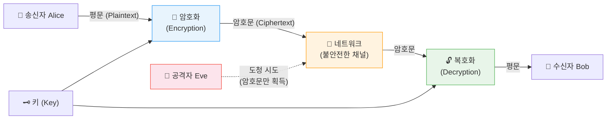

### 핵심 용어 정의

| 용어 | 영어 | 정의 | 예시 |
|------|------|------|------|
| **평문** | Plaintext | 원본 메시지 — 누구나 읽을 수 있는 형태 | `HELLO` |
| **암호문** | Ciphertext | 암호화된 메시지 — 공격자가 해석 불가 | `KHOOR` |
| **암호화** | Encryption | 평문 → 암호문으로 변환하는 과정 | `E(K, P) = C` |
| **복호화** | Decryption | 암호문 → 평문으로 복원하는 과정 | `D(K, C) = P` |
| **키** | Key | 암호화·복호화에 사용되는 비밀 값 | `3` (시저 암호) |

---

## 암호의 기본 원리

### 스테가노그래피 vs 암호

| 구분 | 스테가노그래피 (Steganography) | 암호 (Cryptography) |
|------|-------------------------------|---------------------|
| **목표** | 정보의 존재 자체를 숨김 | 정보의 내용을 숨김 |
| **방법** | 이미지·음성 파일에 데이터 은닉 | 평문을 알아볼 수 없는 형태로 변환 |
| **발각 시** | 정보가 그대로 노출 | 키 없이는 해독 불가 |
| **역사적 예시** | 밀랍으로 덮은 나무판 | 시저 암호, 에니그마 |
| **현대 예시** | JPEG 최하위 비트에 데이터 삽입 | AES, RSA, TLS |

### 커크호프의 원리 (Kerckhoffs's Principle)

> **암호 알고리즘은 공개되어도 되지만, 키는 절대로 공개되어선 안 된다.**

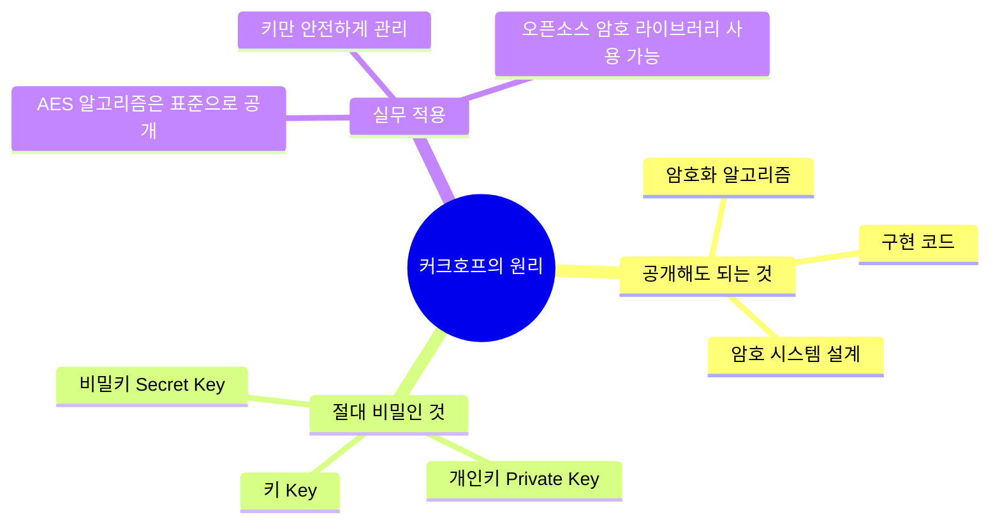

---

## 고전 암호 기법

### 전치법 (Transposition Cipher)

> **문자의 순서를 바꿔** 암호문을 생성하는 방식 — 문자 자체는 변하지 않음

#### 스파르타 봉 암호 (Scytale)

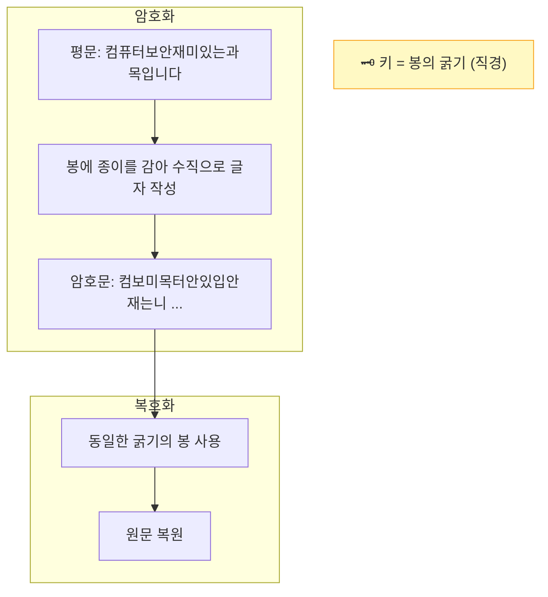

| 특징 | 내용 |
|------|------|
| **키** | 봉(스키탈레)의 굵기 |
| **장점** | 단순하고 직관적 |
| **단점** | 다양한 굵기로 시도하면 해독 가능 |
| **현대적 의미** | 열 전치(Column Transposition) 암호의 원형 |

---

### 치환법 (Substitution Cipher)

> **문자를 다른 문자로 교체**하여 암호문 생성 — 순서는 유지, 내용만 변환

#### 시저 암호 (Caesar Cipher)

알파벳을 일정 수(키 `k`)만큼 뒤로 밀어 치환

```
키 k = 3 일 때:
평문:   A B C D E F G H I J K L M N O P Q R S T U V W X Y Z
암호문: D E F G H I J K L M N O P Q R S T U V W X Y Z A B C
```

| 예시 | 변환 |
|------|------|
| 평문 `HELLO` | → 암호문 `KHOOR` (k=3) |
| 평문 `ATTACK` | → 암호문 `DWWDFN` (k=3) |
| 복호화 `KHOOR` | → 평문 `HELLO` (역방향 3칸) |

**취약점**: 알파벳 26개이므로 최대 26번 시도하면 무조건 해독 가능 → **전수 조사(Brute Force)** 공격에 취약

#### 단일 치환 암호의 취약점 — 빈도 분석 공격

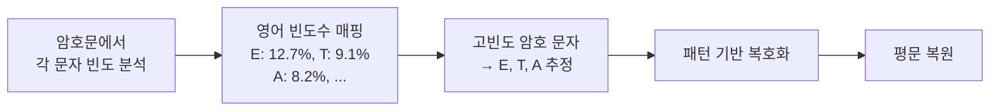

---

### 비즈네르 암호 (Vigenère Cipher)

> 시저 암호를 확장 — **위치마다 다른 키**를 적용하여 빈도 분석 방어

**암호화 예시**

| 위치 | 1 | 2 | 3 | 4 | 5 | 6 |
|------|---|---|---|---|---|---|
| 평문 | C | R | Y | P | T | O |
| 키 (반복) | 3 | 5 | 0 | 3 | 5 | 0 |
| 암호문 | **F** | **W** | **Y** | **S** | **Y** | **O** |

```
C + 3 = F,  R + 5 = W,  Y + 0 = Y
P + 3 = S,  T + 5 = Y,  O + 0 = O
```

**보안 강도 비교**

| 암호 | 키 공간 | 전수 조사 횟수 |
|------|---------|---------------|
| 시저 암호 | 26가지 | 최대 26번 |
| 비즈네르 (키 길이 n) | 26ⁿ 가지 | n=6 → 308,915,776번 |
| 비즈네르 (키 길이 10) | 26¹⁰ 가지 | 약 1.4 × 10¹⁴번 |

---

## 암호 기법 총 비교

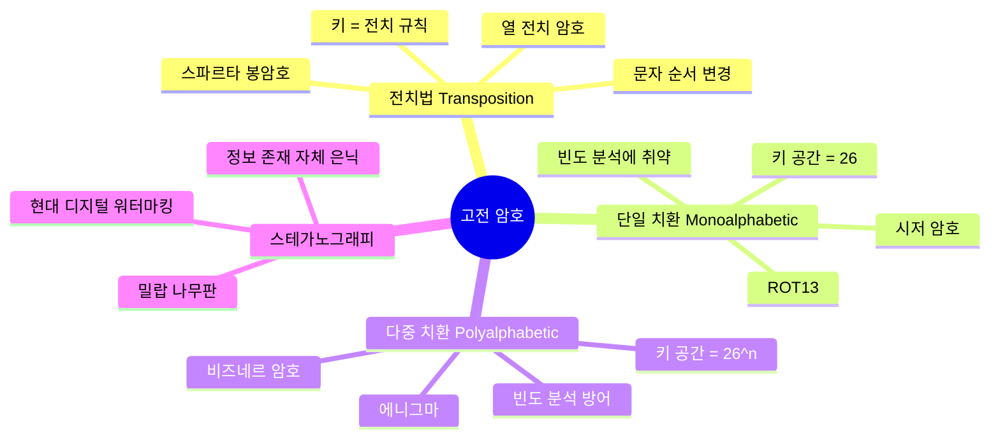

---

## 섀넌의 이론 — 현대 암호학의 기반

> **클로드 섀넌 (Claude Shannon, 1949)**: 정보이론을 암호학에 적용, 완전한 보안의 수학적 조건 정립

### 두 가지 핵심 개념

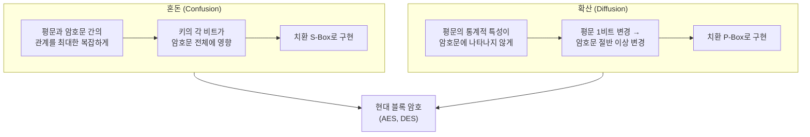

### 원타임 패드 (One-Time Pad, OTP)

> **이론적으로 절대 해독 불가능한** 유일한 암호 방식

- **조건**: 키가 평문과 동일한 길이, 완전히 무작위, 단 1회만 사용
- **원리**: `암호문 = 평문 XOR 키`
- **한계**: 현실에서 사용하기 어려움 (긴 키 사전 공유 필요)

| 평문 | `1 0 1 1 0` |
|------|------------|
| 키 (무작위) | `1 1 0 1 0` |
| 암호문 (XOR) | `0 1 1 0 0` |
| 복호화 (XOR) | `1 0 1 1 0` ✓ |

---

## 현대 암호의 분류

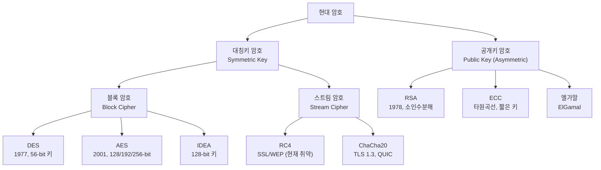

---

## 대칭키 암호 vs 공개키 암호

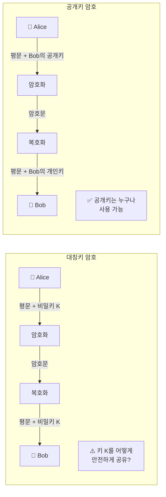

### 상세 비교표

| 비교 항목 | 대칭키 암호 | 공개키 암호 |
|-----------|------------|------------|
| **키 수** | 1개 (동일 키 사용) | 2개 (공개키 + 개인키) |
| **속도** | 빠름 (하드웨어 최적화) | 느림 (수학 연산 집약적) |
| **키 분배** | 어려움 (사전 공유 필요) | 쉬움 (공개키 공개 가능) |
| **키 관리** | n명 → n(n-1)/2 개 키 필요 | n명 → n쌍 키만 필요 |
| **용도** | 대용량 데이터 암호화 | 키 교환, 디지털 서명 |
| **대표 알고리즘** | AES, DES, ChaCha20 | RSA, ECC, ElGamal |
| **안전성 근거** | 키 길이 (128bit 이상) | 수학적 난제 (소인수분해, 이산로그) |

### 실무: 두 방식의 결합 (하이브리드 암호)

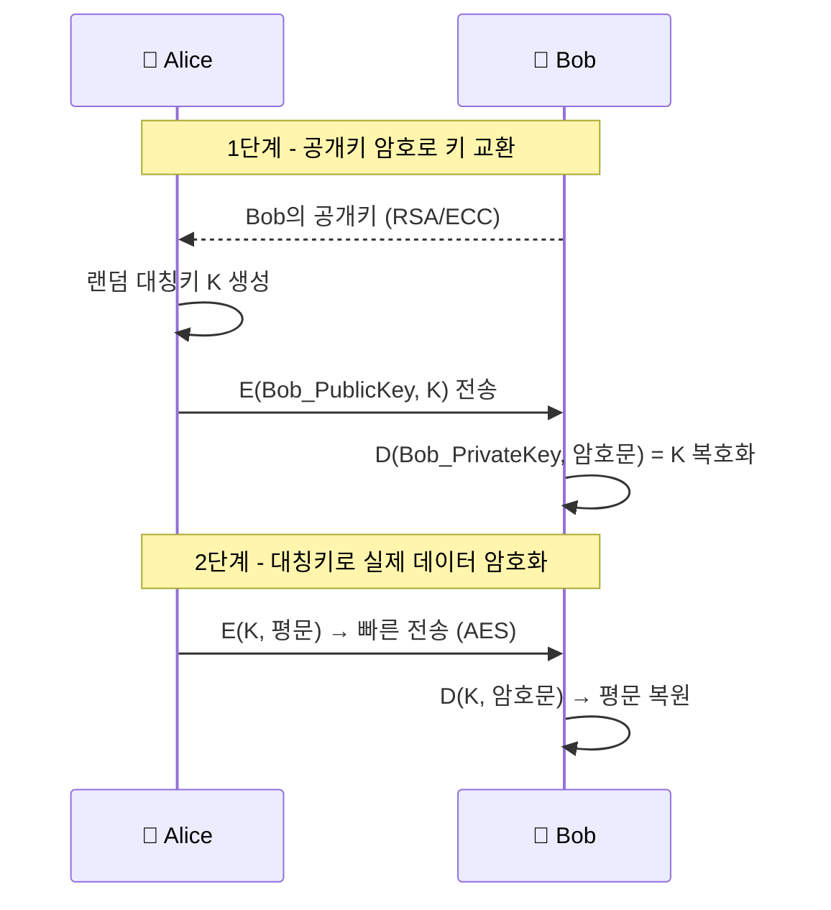

---

## 암호의 역사 타임라인

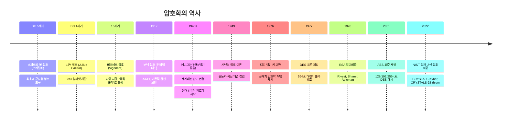

---

## 주요 현대 암호 알고리즘 비교

| 알고리즘 | 종류 | 키 길이 | 보안 강도 | 주요 용도 |
|----------|------|---------|-----------|-----------|
| **DES** | 대칭 블록 | 56-bit | ❌ 취약 (56-bit 해독 가능) | 레거시 시스템 |
| **3DES** | 대칭 블록 | 168-bit | ⚠️ 낮음 | 금융 레거시 |
| **AES-128** | 대칭 블록 | 128-bit | ✅ 안전 | 일반 암호화 |
| **AES-256** | 대칭 블록 | 256-bit | ✅ 매우 안전 | 정부·군사 |
| **ChaCha20** | 대칭 스트림 | 256-bit | ✅ 안전 | TLS 1.3, 모바일 |
| **RSA-2048** | 공개키 | 2048-bit | ✅ 안전 | 키 교환, 서명 |
| **RSA-4096** | 공개키 | 4096-bit | ✅ 매우 안전 | 고보안 서명 |
| **ECC P-256** | 공개키 | 256-bit | ✅ 안전 | TLS, 모바일 (RSA보다 효율적) |
| **Ed25519** | 공개키 서명 | 256-bit | ✅ 안전 | SSH, Git 서명 |

---

## 실무 적용 — 암호가 쓰이는 곳

```mermaid
flowchart TD
    subgraph TLS["🌐 HTTPS / TLS 1.3"]
        T1["ECDHE 키 교환\n(공개키)"]
        T2["AES-256-GCM\n(대칭키 대용량 암호화)"]
        T3["SHA-384 HMAC\n(무결성)"]
        T1 --> T2 --> T3
    end

    subgraph SSH["💻 SSH"]
        S1["Ed25519 공개키 인증"]
        S2["ECDH 세션키 교환"]
        S3["ChaCha20 터널 암호화"]
        S1 --> S2 --> S3
    end

    subgraph JWT["🔑 JWT (인증 토큰)"]
        J1["헤더: 알고리즘 RS256"]
        J2["페이로드: 사용자 정보"]
        J3["서명: RSA 개인키로 서명\n공개키로 검증"]
        J1 --> J2 --> J3
    end

    subgraph BITCOIN["₿ 블록체인"]
        B1["ECDSA 서명\n(트랜잭션 승인)"]
        B2["SHA-256 해시\n(블록 연결)"]
        B3["secp256k1 곡선"]
        B1 --> B2 --> B3
    end
```

### 프로토콜별 사용 암호 기술

| 프로토콜 / 기술 | 키 교환 | 대칭 암호화 | 해시·서명 |
|----------------|---------|------------|-----------|
| **HTTPS (TLS 1.3)** | ECDHE | AES-256-GCM / ChaCha20 | SHA-384 |
| **SSH** | ECDH / DH | AES / ChaCha20 | Ed25519 / RSA |
| **JWT** | — | — | RS256 (RSA+SHA-256) / ES256 |
| **PGP/GPG** | RSA / ECC | AES-256 | SHA-256 |
| **Signal 메신저** | X3DH (이중 래칫) | AES-256-CBC | HMAC-SHA256 |
| **WhatsApp** | Signal Protocol | AES-256 | HMAC-SHA256 |
| **비트코인 지갑** | — | — | ECDSA (secp256k1) |
| **인터넷 뱅킹 (한국)** | RSA | AES-128 | SHA-256 |

---

## 암호학 개념 요약

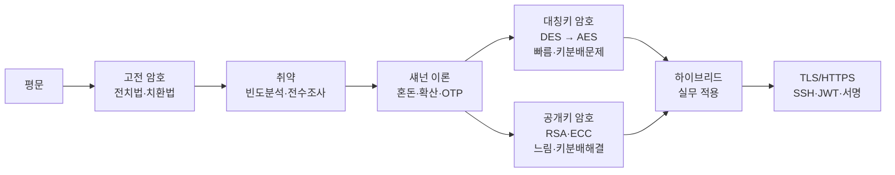

| 개념 | 핵심 요약 |
|------|-----------|
| **커크호프 원리** | 알고리즘은 공개, 키만 비밀 |
| **전치법** | 순서 변환 (스파르타 봉) |
| **치환법** | 문자 교체 (시저, 비즈네르) |
| **혼돈** | 평문↔암호문 관계 복잡화 (S-Box) |
| **확산** | 1비트 변경 → 절반 이상 변경 (P-Box) |
| **OTP** | 이론적 완전 보안, 현실 사용 어려움 |
| **대칭키** | 동일 키, 빠름, 키 분배 어려움 |
| **공개키** | 키 쌍, 느림, 키 분배 쉬움 |
| **하이브리드** | 공개키로 키 교환 → 대칭키로 데이터 암호화 |

- **다음 강의**: 대칭키 암호 심화 (DES·AES 내부 구조, 블록 암호 운용 모드)
